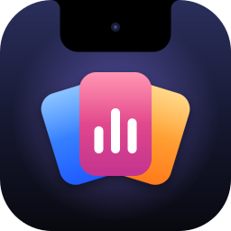

<p align="center">
  
</p>

<h1 align="center">NotchDeck</h1>

<p align="center">
  The MacBook notch, made useful — and a synthetic one on displays that do not have it.
</p>

<p align="center">
  <a href="https://github.com/skensell201/notchdeck/releases/latest"><b>Download the latest release</b></a>
</p>

---

NotchDeck is a native macOS utility that lives in the notch. Hover it and it
opens into a panel of modules; move away and it tucks itself back in. Every
click outside the black shape falls through to whatever is underneath, so it
never gets in the way of the menu bar.

## Features

| Module | What it does |
|---|---|
| **Media** | Now playing from any app — artwork, scrubber, transport. Swipe with two fingers to change track. |
| **Shelf** | Drag files onto the notch to park them, drag them back out anywhere, or AirDrop them. |
| **Clipboard** | Searchable history with pinning. Password-manager copies are never recorded. |
| **Timer** | A pomodoro that keeps counting, and showing, with the notch closed. |
| **Stats** | Battery, CPU, memory and network throughput. |
| **Mirror** | A camera preview for checking yourself before a call. |
| **Shortcuts** | List, pin and run your Shortcuts. |
| **Calendar** | Today and the next few days, with a join button for Zoom, Meet, Teams and Webex. |

Plus **live activities**: plugging in the charger or connecting headphones sags
the notch and drops a little capsule with the device's name. An optional switch
hides the system volume overlay.

Everything is configurable in **Settings** — module order and visibility, the
size of the synthetic notch on external displays, hover timing, a tint for the
panel, and launch at login.

### Using it

| Gesture | Result |
|---|---|
| Hover the notch | Opens after a short dwell |
| Scroll down / up over it | Opens / closes immediately |
| Click the open panel | Pins it open; click elsewhere to close |
| Two-finger swipe left / right | Next / previous track |
| Drag a file onto the notch | Opens the Shelf mid-drag |

NotchDeck has no Dock icon. It lives in the **menu bar**, and that is where
Settings and Quit are.

## Installing

1. Download `NotchDeck-<version>.dmg` from the
   [latest release](https://github.com/skensell201/notchdeck/releases/latest).
2. Open it and drag **NotchDeck** to **Applications**.
3. Get it past Gatekeeper once (see below), then launch it.

### First launch

The app is signed but **not notarized** — notarization needs a paid Developer
ID, and reading now-playing state relies on a private framework, so the App
Store was never an option either. macOS therefore blocks the first launch with
*"Apple could not verify NotchDeck is free of malware"*.

**Option A — System Settings.** Double-click NotchDeck and dismiss the dialog.
Open **System Settings → Privacy & Security**, scroll to the bottom and click
**Open Anyway** next to the message about NotchDeck. Every launch after that is
an ordinary one.

**Option B — Terminal.** Clear the quarantine flag:

```bash
xattr -d com.apple.quarantine /Applications/NotchDeck.app
```

Control-click → Open, the advice you will find elsewhere, no longer works:
macOS 15 removed that bypass.

### Permissions

Two tabs ask for permission the first time you open them — **Mirror** for the
camera and **Calendar** for events. Nothing else needs any. Declining leaves
that one tab explaining itself; the rest of the app is unaffected. The
**Permissions** tab in Settings shows the current status and links to the right
System Settings pane.

### Requirements

- macOS 26.0 or later
- Apple silicon

## Known limitations

- Brightness and Focus changes are not announced — there is no public API for
  either.
- Network throughput can read as unknown for a couple of seconds every few
  hours, when Darwin's 32-bit interface counters wrap.

## Documentation

- [Development](docs/DEVELOPMENT.md) — building from source, project layout, releasing
- [Manual testing](docs/TESTING.md) — the checklist for UI and windowing changes
- [Changelog](CHANGELOG.md)
- [Design specs](docs/specs/) and [implementation plans](docs/plans/)
- [Third-party notices](THIRD_PARTY_NOTICES.md)

## Acknowledgements

Now-playing state comes from
[`ungive/mediaremote-adapter`](https://github.com/ungive/mediaremote-adapter),
vendored under the BSD 3-Clause License — see
[THIRD_PARTY_NOTICES.md](THIRD_PARTY_NOTICES.md).
